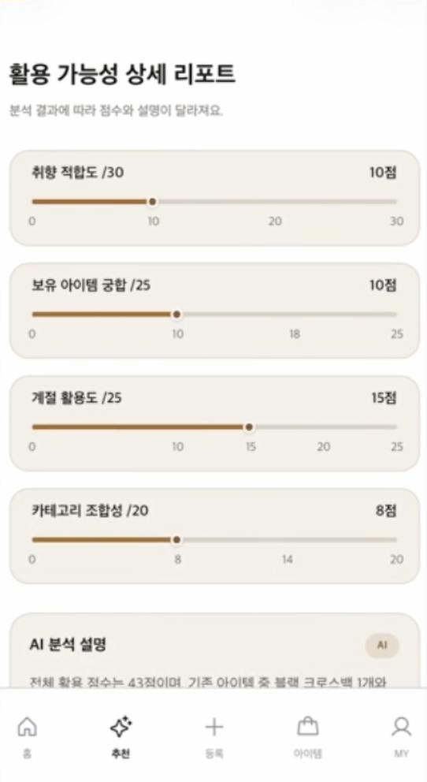
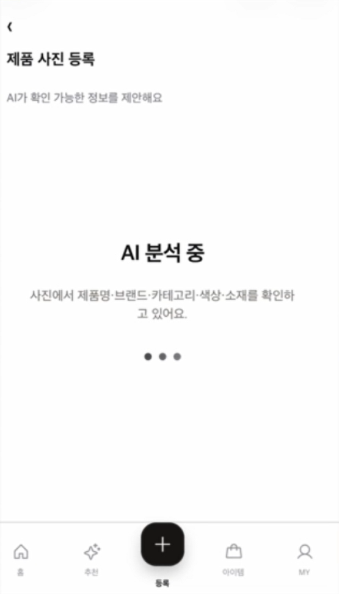
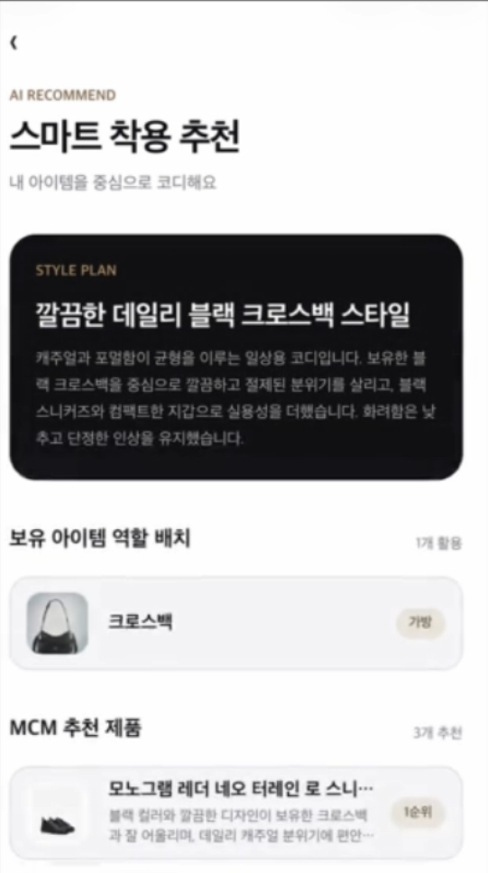
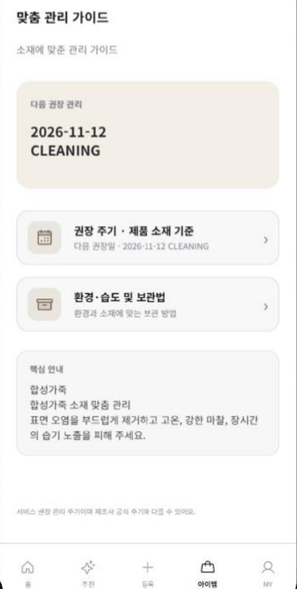
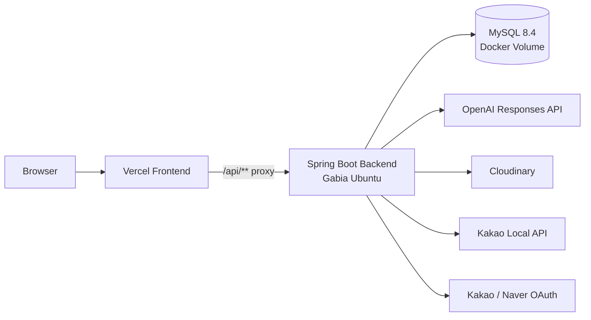

# 입을래? Backend

> **취향·보유 아이템·상황 데이터를 연결해, 명품의 구매 전 판단부터 착용·관리까지 이어주는 AI 기반 명품 활용 서비스**

2026 멋쟁이사자처럼 중앙해커톤에서 개발한 **`입을래?`의 Spring Boot Backend**입니다.

- **Team**: Frontend 2 / Backend 2 / Design 1
- **My Role**: Backend Developer
- **Period**: 2026.07 ~ 2026.08
- **Original Team Repository**: https://github.com/pro660/Hackathon_BE

> 이 저장소는 팀 프로젝트의 Git history와 contributor 기록을 유지한 채,  
> **Backend 2인 중 제가 담당한 영역과 기술적 의사결정이 보이도록 포트폴리오용으로 재정리한 저장소**입니다.

---

## Demo

실제 배포 서비스에서 동작한 주요 기능 화면입니다.

<table>
  <tr>
    <td align="center" width="50%">
      
      <br/>
      <b>구매 전 활용 가능성 분석</b>
<br/>
<sub>Rule-Based 활용 점수 계산 + OpenAI 자연어 설명</sub>
    </td>
    <td align="center" width="50%">
      
      <br/>
      <b>AI 기반 아이템 등록</b>
<br/>
<sub>이미지 분석을 공통 비동기 AI Job으로 처리</sub>
    </td>
  </tr>

  <tr>
    <td align="center" width="50%">
      
      <br/>
      <b>스마트 착용 추천</b>
<br/>
<sub>보유 아이템·상황 기반 STYLE_PLAN 생성</sub>
    </td>
    <td align="center" width="50%">
      
      <br/>
      <b>맞춤 관리 가이드</b>
<br/>
<sub>소재 기반 관리 주기·보관법·알림 제공</sub>
    </td>
  </tr>
</table>

### Backend Flow

```text
Image Upload
    ↓
ImageAsset / Cloudinary
    ↓
ITEM_ANALYSIS AI Job
    ↓
UserItem

Preference + UserItem
    ↓
Purchase Utility Rule Engine
    ↓
OpenAI Explanation

UserItem + Situation
    ↓
STYLE_PLAN AI Job
    ↓
Style Recommendation

UserItem
    ↓
Care Policy
    ↓
Care Guide / Calendar / Reminder
```

> Demo 화면은 실제 배포 서비스에서 캡처한 화면입니다.  
> 각 기능의 Backend 구현 내용은 아래의 `My Contribution`과  
> `Technical Challenge` 섹션에서 확인할 수 있습니다.

---

## My Contribution

Backend 2인 중 한 명으로 참여했으며, **DB 변경 관리·추천·AI 처리 구조·이미지 파이프라인·구매 활용성 분석**을 중심으로 담당했습니다.

| 영역 | 담당 내용 |
| --- | --- |
| Backend Foundation | Java 21 / Spring Boot / Gradle / MySQL 초기 환경 구성 |
| Common API | 공통 성공·오류 응답, Validation, Business Exception |
| Persistence | JPA Auditing, UTC 시간 정책 |
| DB Migration | **Flyway 도입 및 Migration 운영 정책 구축** |
| Integration Test | **Testcontainers 기반 실제 MySQL 통합 테스트 환경 구축** |
| MCM Product | Catalog, Filter, Sort, Pagination, Importer / Validator |
| Preference | 사용자 취향 프로필 조회·저장 |
| Wishlist / Cart | 상품 찜, 구매 후보 장바구니 |
| Recommendation | 취향 기반 MCM 상품 추천 |
| Purchase Utility | **구매 전 활용 가능성 Rule-Based 분석** |
| AI Infrastructure | **공통 비동기 AI Job 구조** |
| Image Pipeline | **Cloudinary + ImageAsset lifecycle** |
| ITEM_ANALYSIS | 이미지 기반 브랜드·카테고리·색상·소재 분석 |
| AI Provenance | AI 분석 결과와 입력 이미지·UserItem 정합성 검증 |
| Product Passport | 보유 아이템 Passport Read Model |
| Care | 소재 기반 관리 가이드·캘린더·알림 |
| Account Security | 비밀번호 변경, 동시 변경 제어 |
| Documentation | API Convention / README / AI API 계약 동기화 |

### Representative Pull Requests

- [#1 Spring Boot 백엔드 초기 설정](https://github.com/pro660/Hackathon_BE/pull/1)
- [#21 Flyway 및 DB 통합 테스트 기반 구축](https://github.com/pro660/Hackathon_BE/pull/21)
- [#25 MCM 제품 Catalog 및 Import](https://github.com/pro660/Hackathon_BE/pull/25)
- [#28 취향 Profile](https://github.com/pro660/Hackathon_BE/pull/28)
- [#29 제품 추천](https://github.com/pro660/Hackathon_BE/pull/29)
- [#34 구매 전 활용 가능성 분석 기반](https://github.com/pro660/Hackathon_BE/pull/34)
- [#36 공통 AI Job 및 OpenAI 구매 활용성 분석](https://github.com/pro660/Hackathon_BE/pull/36)
- [#38 ImageAsset / Cloudinary](https://github.com/pro660/Hackathon_BE/pull/38)
- [#39 ITEM_ANALYSIS AI 분석](https://github.com/pro660/Hackathon_BE/pull/39)
- [#40 ITEM_ANALYSIS ↔ MyItem 연동 / provenance](https://github.com/pro660/Hackathon_BE/pull/40)
- [#42 Product Passport](https://github.com/pro660/Hackathon_BE/pull/42)
- [#45 맞춤 관리 가이드·캘린더·알림](https://github.com/pro660/Hackathon_BE/pull/45)
- [#47 MCM 제품 장바구니](https://github.com/pro660/Hackathon_BE/pull/47)
- [#54 비밀번호 변경](https://github.com/pro660/Hackathon_BE/pull/54)

---

## System Architecture



운영 구성:

```text
Browser
  ↓
Vercel
  ↓
/api/** Proxy
  ↓
Gabia Ubuntu
  ↓
Docker Compose
  ├─ Spring Boot
  └─ MySQL 8.4
```

---

## Technical Challenge 1 — AI와 Rule-Based 역할 분리

구매 활용성 점수처럼 **같은 입력에 일관된 결과와 설명 가능성**이 필요한 영역은 LLM에 맡기지 않았습니다.

```text
Rule-Based Calculation
  ├─ 취향 적합도           30
  ├─ 스타일 조합           25
  ├─ 계절 활용성           25
  └─ 보유 Category 조합    20
            ↓
      Total Score / 100
            ↓
         OpenAI
            ↓
   사용자용 자연어 설명
```

> 현재 점수는 구매 성공 확률이 아니라, MVP에서 활용 가능성을 설명하기 위한 **heuristic policy**입니다.

---

## Technical Challenge 2 — Common Async AI Job

OpenAI 호출은 DB 조회보다 느리고 외부 장애 가능성이 있기 때문에 일반 요청과 분리했습니다.

지원 Job:

- `PURCHASE_UTILITY`
- `ITEM_ANALYSIS`
- `STYLE_PLAN`

상태:

```text
PENDING → PROCESSING → SUCCEEDED
                   └→ FAILED
```

Client는 `jobId`를 받은 뒤 polling으로 상태를 조회합니다.

중복·실패 처리:

- `Idempotency-Key`
- Request identity / input hash
- 동일 입력 결과 재사용
- stale job 처리
- 오류 분류
- 기능별 fallback 정책

---

## Technical Challenge 3 — ImageAsset + ITEM_ANALYSIS

이미지 binary와 관계형 데이터를 분리했습니다.

```text
사용자 이미지
  ↓
Cloudinary
  ↓
ImageAsset Metadata (MySQL)
  ↓
ITEM_ANALYSIS Job
  ↓
brand / name / category / color / material
  ↓
사용자 확인·수정
  ↓
UserItem 저장
```

AI 결과를 자동 확정하지 않고 사용자가 확인·수정한 뒤 저장하며, 분석 실패 시 수동 등록도 가능합니다.

---

## Technical Challenge 4 — Flyway + Testcontainers

여러 개발 환경에서 Schema가 달라지는 문제를 줄이기 위해 DB 변경을 코드처럼 관리했습니다.

- Flyway Migration: **V1 ~ V21**
- JPA: `ddl-auto=validate`
- 이미 적용된 Migration 수정 금지
- 변경 시 신규 Migration 추가

H2만으로 끝내지 않고 Testcontainers로 실제 MySQL 기반 통합 테스트를 구성했습니다.

```text
JUnit
  ↓
Testcontainers
  ↓
MySQL
  ↓
Flyway Migration
  ↓
Repository / Integration Test
```

---

## Authentication / Security

- Stateless JWT
- Access Token: `Authorization: Bearer <token>`
- Refresh Token: `HttpOnly Cookie`
- Client가 전달한 userId를 신뢰하지 않고 JWT 사용자 기준 처리
- 사용자별 Resource ownership 검증
- 비밀번호 변경 시 BCrypt 검증
- 동시 비밀번호 변경에 pessimistic write lock 적용

---

## Tech Stack

| Category | Technology |
| --- | --- |
| Language | Java 21 |
| Framework | Spring Boot 4.1.0 |
| Build | Gradle |
| Web | Spring Web MVC |
| ORM | Spring Data JPA |
| Database | MySQL 8.4 |
| Migration | Flyway |
| Security | Spring Security / JWT |
| OAuth | Kakao / Naver |
| AI | OpenAI Responses API |
| Image | Cloudinary |
| Place | Kakao Local API |
| Test | JUnit 5 / H2 / Testcontainers |
| API Docs | Swagger / OpenAPI |
| CI | GitHub Actions |
| Container | Docker / Docker Compose |
| Frontend Deploy | Vercel |
| Backend Deploy | Gabia Ubuntu |

---

## Team-wide Implemented Features

프로젝트 전체 Backend 기준 구현 기능입니다. **위의 My Contribution과 구분합니다.**

- 회원가입 / 로그인 / Kakao·Naver OAuth
- JWT Authentication
- 사용자 Preference
- MCM Product Catalog
- Wishlist / Cart
- Product Recommendation
- My Item CRUD
- Cloudinary ImageAsset
- ITEM_ANALYSIS
- Purchase Utility
- Product Passport
- STYLE_PLAN / StylePlan CRUD
- Kakao Local 장소 검색·추천·저장
- Care Guide / Calendar / Notification
- Home Aggregate API
- Password Change

> 독립적인 착용/사용 기록 API는 최종 MVP 구현 범위에 포함되지 않았습니다.

---

## CI / Test

GitHub Actions는 `main` 대상 PR과 `main` push에서 실행됩니다.

```bash
./gradlew clean check --no-daemon
```

로컬:

```bash
./gradlew test
./gradlew integrationTest
./gradlew clean check
```

`integrationTest`는 Testcontainers 기반 MySQL 검증이므로 Docker가 필요합니다.

---

## Local Run

```bash
git clone https://github.com/developer-sw/ippulrae-backend.git
cd ippulrae-backend
```

필수 환경변수는 [`.env.example`](./.env.example)을 참고합니다.

Windows:

```powershell
.\gradlew.bat bootRun
```

macOS / Linux:

```bash
./gradlew bootRun
```

실제 API Key와 Secret은 저장소에 커밋하지 않습니다.

---

## Current Limitations / Future Improvements

해커톤 MVP 이후 개선 대상으로 남긴 영역입니다.

- 실제 사용자 행동 데이터 기반 추천 Weight 검증
- Redis Cache
- AI Job Queue / Worker 분리
- 부하 테스트 및 Query Profiling
- Monitoring / Observability
- Application / DB 물리 분리 및 Horizontal Scaling
- 독립적인 Wear History API
- 실제 Brand / Commerce System Integration

---

## Related Documents

- [`API_CONVENTIONS.md`](./API_CONVENTIONS.md)
- [`.env.example`](./.env.example)
- [`build.gradle`](./build.gradle)
- [`.github/workflows/ci.yml`](./.github/workflows/ci.yml)
- [`compose.yaml`](./compose.yaml)
- [`Dockerfile`](./Dockerfile)
- [`src/main/resources/db/migration`](./src/main/resources/db/migration)
- [`src/main/resources/data/mcm-products.json`](./src/main/resources/data/mcm-products.json)

---

## Original Team Repository

전체 팀 개발 이력과 Pull Request / Contributor History:

**https://github.com/pro660/Hackathon_BE**
